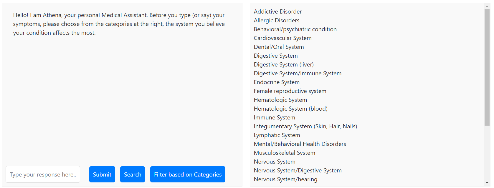
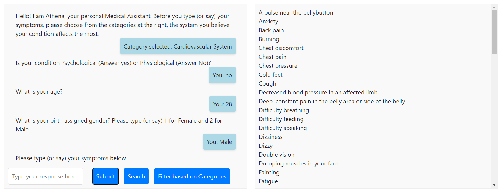

# ATHENA MEDICAL CHATBOT

- python3 -m venv venv
- venv\Scripts\activate
- pip install -r requirements.txt

## HYBRID DIALOG SYSTEM case

Click or type and then click at any category at the right list

Insert other info (click submit button everytime)

